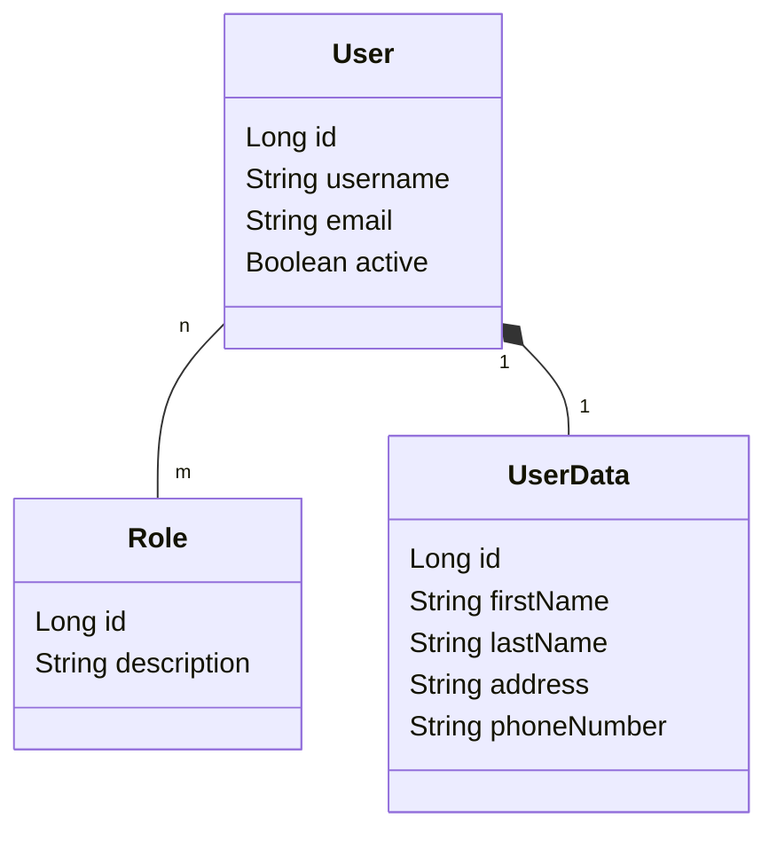

# limitadorum

Sistema de gestión de usuarios y roles desarrollado como trabajo práctico de la
carrera de Ingeniería en Informática de la **Universidad de Mendoza**.

La aplicación modela usuarios que pueden tener asignados uno o más roles, con el
objetivo de servir como base para un sistema de control de acceso y permisos.

---

## Stack

| Componente | Versión |
|---|---|
| Java | 25 |
| Spring Boot | 4.1.1 |
| Spring Data JPA | (gestionada por Spring Boot) |
| PostgreSQL | driver `org.postgresql` |
| Maven | 3.9.16 (vía wrapper) |
| Lombok | (gestionada por Spring Boot) |
| H2 | solo en tests |

---

## Requisitos previos

- **JDK 25**. Verificalo con `java -version`; tiene que decir `25`, y tiene que
  ser un **JDK**, no un JRE (un JRE no incluye compilador y Maven falla con
  *"No compiler is provided in this environment"*).

  ```bash
  winget install EclipseAdoptium.Temurin.25.JDK
  ```

- **PostgreSQL** instalado en el sistema (puerto 5432) y/o **Docker** con
  **Docker Compose** (puerto 5433). Ver [Base de datos](#base-de-datos). Para
  correr los tests no hace falta ninguno de los dos: usan H2 embebida.

No hace falta instalar Maven: el repositorio incluye el *Maven Wrapper*
(`mvnw` / `mvnw.cmd`), que descarga la versión correcta la primera vez.

---

## Configuración

La aplicación usa **perfiles de Spring** para elegir contra qué base de datos
trabaja. Se definen en
[`src/main/resources/application.yaml`](src/main/resources/application.yaml):

| Perfil | Puerto | Base | Dónde corre |
|---|---|---|---|
| `dev` (por defecto) | 5432 | `USERS_AUTH_DEV` | PostgreSQL del sistema, administrado con pgAdmin |
| `prod` | 5432 | `USERS_AUTH` | PostgreSQL del sistema, administrado con pgAdmin |
| `docker` | 5433 | `USERS_AUTH_DEV` | Contenedor de `docker-compose.yml` |

Si no se indica ninguno, se activa `dev`. Para elegir otro:

```bash
./mvnw spring-boot:run -Dspring-boot.run.profiles=docker
```

Cualquier perfil admite sobreescribir la conexión por variables de entorno, sin
tocar el repositorio:

| Variable | Descripción |
|---|---|
| `DB_URL` | URL JDBC completa |
| `DB_USER` | Usuario de la base |
| `DB_PASSWORD` | Contraseña del usuario |

Para el contenedor, copiá `.env.example` a `.env` y ajustá los valores. Ese
archivo está en `.gitignore` y no se versiona.

```bash
cp .env.example .env
```

El esquema se genera automáticamente con `spring.jpa.hibernate.ddl-auto: update`.
Es cómodo para desarrollo, pero **no es apto para producción**: en un entorno
real corresponde usar migraciones versionadas (Flyway o Liquibase).

> **Nota sobre los nombres en mayúsculas.** PostgreSQL convierte los
> identificadores a minúsculas salvo que se los escriba entre comillas dobles.
> Las bases `USERS_AUTH_DEV` y `USERS_AUTH` se crean entrecomilladas, así que el
> nombre queda literalmente en mayúsculas y hay que respetarlo tal cual en la
> URL JDBC y en cualquier `psql -d`.

---

## Base de datos

El proyecto puede trabajar contra dos instancias de PostgreSQL:

- La **instalada en el sistema**, en el puerto **5432**, que se administra con
  pgAdmin. Es la que usan los perfiles `dev` y `prod`.
- La del **contenedor Docker** definido en
  [`docker-compose.yml`](docker-compose.yml), mapeada al puerto **5433** del
  host para no chocar con la anterior. Es la que usa el perfil `docker`.

Para levantar el contenedor:

```bash
docker compose up -d
```

La base `limitadorum` se crea sola en el primer arranque. El contenedor tiene un
*healthcheck* con `pg_isready`, así que podés verificar que esté listo con:

```bash
docker compose ps
```

Debería figurar como `Up (healthy)`.

| Comando | Qué hace |
|---|---|
| `docker compose up -d` | Levanta la base en segundo plano |
| `docker compose ps` | Muestra el estado y el healthcheck |
| `docker compose logs -f db` | Sigue los logs de PostgreSQL |
| `docker compose stop` | Detiene el contenedor conservando los datos |
| `docker compose down` | Elimina el contenedor conservando los datos |
| `docker compose down -v` | Elimina el contenedor **y borra los datos** |

Para abrir una consola `psql` contra el contenedor:

```bash
docker exec -it limitadorum-db psql -U postgres -d USERS_AUTH_DEV
```

Los datos persisten en el volumen `postgres_data`, así que sobreviven a
`docker compose down`. Solo se pierden con `docker compose down -v`.

Las bases `USERS_AUTH_DEV` y `USERS_AUTH` del PostgreSQL del sistema se crean
desde pgAdmin, o por línea de comandos:

```sql
CREATE DATABASE "USERS_AUTH_DEV";
CREATE DATABASE "USERS_AUTH";
```

---

## Cómo levantar el proyecto

Con la base levantada (`docker compose up -d`), desde Git Bash o WSL:

```bash
./mvnw spring-boot:run
```

Desde PowerShell o CMD:

```bash
.\mvnw.cmd spring-boot:run
```

La aplicación queda escuchando en `http://localhost:8080`. Todavía no expone
endpoints REST: la capa de controllers está pendiente.

### Tests

```bash
./mvnw test
```

Los tests de repositorio usan `@DataJpaTest` con una base **H2 embebida**, así
que corren sin necesidad de tener PostgreSQL levantado.

### Empaquetado

```bash
./mvnw package
```

Genera el JAR ejecutable en `target/limitadorum-0.0.1-SNAPSHOT.jar`.

---

## Modelo de datos



- **`User`** → tabla `users`. `username` es único y obligatorio; `email` es
  obligatorio.
- **`Role`** → tabla `role`. `description` es única y obligatoria.
- **`UserData`** → tabla `user_data`. Guarda los datos personales del usuario.
  Es una **composición**: su ciclo de vida está atado al de `User`, así que se
  persiste y se elimina en cascada junto con él.
- La relación **muchos a muchos** se materializa en la tabla intermedia
  `user_roles` (`user_id`, `role_id`). `User` es el lado propietario de la
  relación; `Role` es el lado inverso (`mappedBy = "roles"`).

El diagrama de clases completo está en
[`docs/diagrama_usuario.puml`](docs/diagrama_usuario.puml). Para renderizarlo
sin instalar PlantUML:

```bash
docker run --rm -i plantuml/plantuml -tpng -pipe < docs/diagrama_usuario.puml > docs/diagrama_usuario.png
```

En VS Code, la extensión *PlantUML* lo previsualiza con `Alt+D`.

---

## Estructura del proyecto

Arquitectura clásica de tres capas de Spring Boot:

```
src/main/java/ar/edu/um/limitadorum/
├── LimitadorumApplication.java   # punto de entrada
├── controllers/                  # capa de presentación (pendiente)
├── services/                     # capa de negocio (pendiente)
├── domain/                       # entidades JPA
│   ├── User.java
│   └── Role.java
└── repository/                   # capa de persistencia
    ├── UserRepository.java
    └── RoleRepository.java
```

---

## Estado actual

- [x] Entidades `User` y `Role` con relación muchos a muchos
- [x] Repositorios Spring Data JPA
- [x] Configuración de conexión a PostgreSQL
- [x] Base de datos containerizada con Docker Compose
- [x] Tests de repositorio
- [x] Entidad `UserData` (datos personales del usuario)
- [ ] Capa de servicios
- [ ] Endpoints REST
- [ ] Integración continua

---

## Convención de commits

Se sigue [Conventional Commits](https://www.conventionalcommits.org/) con
referencia al issue correspondiente:

```
#<nro-issue> <tipo>(<scope>): <descripción>
```

Ejemplo: `#2 feat(domain): agregar entidades User y Role`

Tipos usados: `feat`, `fix`, `refactor`, `test`, `docs`, `chore`.
