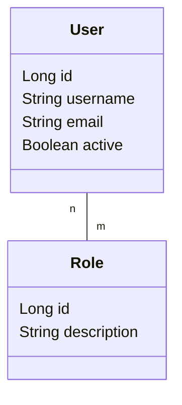

# limitadorum

Sistema de gestión de usuarios y roles desarrollado como trabajo práctico de la
carrera de Ingeniería en Informática de la **Universidad de Mendoza**.

La aplicación modela usuarios que pueden tener asignados uno o más roles, con el
objetivo de servir como base para un sistema de control de acceso y permisos.

---

## Stack

| Componente | Versión |
|---|---|
| Java | 25 |
| Spring Boot | 4.1.1 |
| Spring Data JPA | (gestionada por Spring Boot) |
| PostgreSQL | driver `org.postgresql` |
| Maven | 3.9.16 (vía wrapper) |
| Lombok | (gestionada por Spring Boot) |
| H2 | solo en tests |

---

## Requisitos previos

- **JDK 25**. Verificalo con `java -version`; tiene que decir `25`, y tiene que
  ser un **JDK**, no un JRE (un JRE no incluye compilador y Maven falla con
  *"No compiler is provided in this environment"*).

  ```bash
  winget install EclipseAdoptium.Temurin.25.JDK
  ```

- **Docker** y **Docker Compose**, para levantar la base de datos. No hace falta
  instalar PostgreSQL en el sistema: corre en un contenedor (ver
  [Base de datos](#base-de-datos)). Tampoco hace falta para correr los tests,
  que usan H2 embebida.

No hace falta instalar Maven: el repositorio incluye el *Maven Wrapper*
(`mvnw` / `mvnw.cmd`), que descarga la versión correcta la primera vez.

---

## Configuración

La conexión a la base se define en
[`src/main/resources/application.yaml`](src/main/resources/application.yaml) y
puede sobreescribirse por variables de entorno, sin tocar el repositorio:

| Variable | Default | Descripción |
|---|---|---|
| `DB_URL` | `jdbc:postgresql://localhost:5432/limitadorum` | URL JDBC de la base |
| `DB_USER` | `postgres` | Usuario de la base |
| `DB_PASSWORD` | `postgres` | Contraseña del usuario |

Las mismas variables las consume `docker-compose.yml`, así que la aplicación y
el contenedor se configuran desde un único lugar. Copí `.env.example` a `.env`
y ajustá los valores; ese archivo está en `.gitignore` y no se versiona.

```bash
cp .env.example .env
```

El esquema se genera automáticamente con `spring.jpa.hibernate.ddl-auto: update`.
Es cómodo para desarrollo, pero **no es apto para producción**: en un entorno
real corresponde usar migraciones versionadas (Flyway o Liquibase).

---

## Base de datos

PostgreSQL corre en un contenedor Docker definido en
[`docker-compose.yml`](docker-compose.yml). Para levantarlo:

```bash
docker compose up -d
```

La base `limitadorum` se crea sola en el primer arranque. El contenedor tiene un
*healthcheck* con `pg_isready`, así que podés verificar que esté listo con:

```bash
docker compose ps
```

Debería figurar como `Up (healthy)`.

| Comando | Qué hace |
|---|---|
| `docker compose up -d` | Levanta la base en segundo plano |
| `docker compose ps` | Muestra el estado y el healthcheck |
| `docker compose logs -f db` | Sigue los logs de PostgreSQL |
| `docker compose stop` | Detiene el contenedor conservando los datos |
| `docker compose down` | Elimina el contenedor conservando los datos |
| `docker compose down -v` | Elimina el contenedor **y borra los datos** |

Para abrir una consola `psql` contra el contenedor:

```bash
docker exec -it limitadorum-db psql -U postgres -d limitadorum
```

Los datos persisten en el volumen `postgres_data`, así que sobreviven a
`docker compose down`. Solo se pierden con `docker compose down -v`.

> **Si ya tenés PostgreSQL instalado en el sistema**, va a ocupar el puerto 5432
> y el contenedor no va a poder mapearlo. Detené el servicio local, o cambiá
> `DB_PORT` en el `.env` a otro puerto (por ejemplo `5433`) y actualizá `DB_URL`
> en consecuencia.

---

## Cómo levantar el proyecto

Con la base levantada (`docker compose up -d`), desde Git Bash o WSL:

```bash
./mvnw spring-boot:run
```

Desde PowerShell o CMD:

```bash
.\mvnw.cmd spring-boot:run
```

La aplicación queda escuchando en `http://localhost:8080`. Todavía no expone
endpoints REST: la capa de controllers está pendiente.

### Tests

```bash
./mvnw test
```

Los tests de repositorio usan `@DataJpaTest` con una base **H2 embebida**, así
que corren sin necesidad de tener PostgreSQL levantado.

### Empaquetado

```bash
./mvnw package
```

Genera el JAR ejecutable en `target/limitadorum-0.0.1-SNAPSHOT.jar`.

---

## Modelo de datos



- **`User`** → tabla `users`. `username` es único y obligatorio; `email` es
  obligatorio.
- **`Role`** → tabla `role`. `description` es única y obligatoria.
- La relación **muchos a muchos** se materializa en la tabla intermedia
  `user_roles` (`user_id`, `role_id`). `User` es el lado propietario de la
  relación; `Role` es el lado inverso (`mappedBy = "roles"`).

---

## Estructura del proyecto

Arquitectura clásica de tres capas de Spring Boot:

```
src/main/java/ar/edu/um/limitadorum/
├── LimitadorumApplication.java   # punto de entrada
├── controllers/                  # capa de presentación (pendiente)
├── services/                     # capa de negocio (pendiente)
├── domain/                       # entidades JPA
│   ├── User.java
│   └── Role.java
└── repository/                   # capa de persistencia
    ├── UserRepository.java
    └── RoleRepository.java
```

---

## Estado actual

- [x] Entidades `User` y `Role` con relación muchos a muchos
- [x] Repositorios Spring Data JPA
- [x] Configuración de conexión a PostgreSQL
- [x] Base de datos containerizada con Docker Compose
- [ ] Tests de repositorio
- [ ] Entidad `UserData` (datos personales del usuario)
- [ ] Capa de servicios
- [ ] Endpoints REST
- [ ] Integración continua

---

## Convención de commits

Se sigue [Conventional Commits](https://www.conventionalcommits.org/) con
referencia al issue correspondiente:

```
#<nro-issue> <tipo>(<scope>): <descripción>
```

Ejemplo: `#2 feat(domain): agregar entidades User y Role`

Tipos usados: `feat`, `fix`, `refactor`, `test`, `docs`, `chore`.
